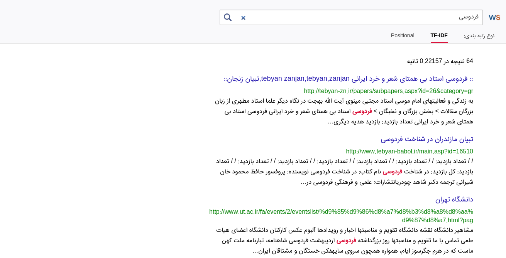

# WebSurfer
## Introduction
A simple search engine created for Information Recovery And Web Search course final project.

This project is aimed to index web documents and then get query from user through web interface, process query, extract documents based on the query and ranking extracted documents and display them to user.

## Description
This project is written in python entirely. The Project consists of two major parts:
* Indexer engine
* Query processor

Indexer engine is written in pure python and includes these stages:
1. Read documents from storage
2. Add docs to a thread-safe queue
3. Pop docs from queue and index them by indexer workers (workers run in their own processes concurrently)
    1. Normalize text (convert escaped chars, remove unnecessary HTML tags, ...)
    2. Parse text (extract body and title)
    3. Tokenize
    4. Create dictionary and posting list
    5. Save postings list to MongoDB

Query processor created using Django and provides a web interface for users to enter query and view search result. This module includes:
1. Get query from user
2. Fetch postings list from MongoDB based on query
3. Ranking documents using two methods:
    * TF-IDF
    * Positional
4. Sort documents based on ranking
5. Show results to the user

## Dependencies
* Python 3x
* MongoDB
* Django v3+

## Architecture
[Read more](./presentation/SearchEngines-Fall2020.pdf) about architecture and details of the project

## Screenshots

